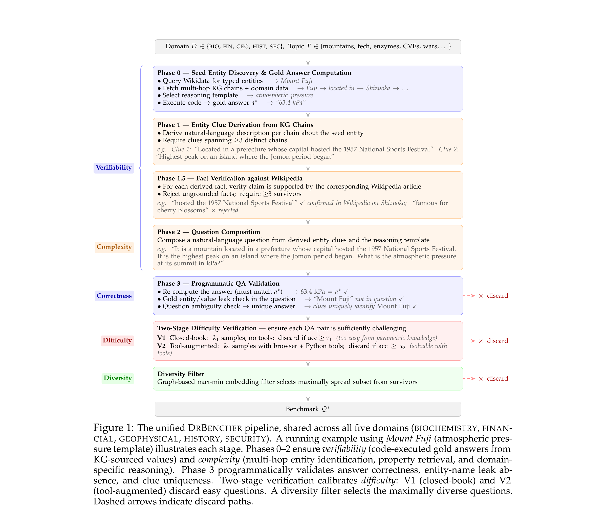

# DrBencher

**DrBencher** is a benchmark-generation framework that creates challenging, verifiable,
and diverse evaluation datasets for agentic language models, using no seed passages or provenance
text for QA generation and producing every QA pair answer-first in the following order:

- **Entity & property retrieval** — a seed entity is discovered via SPARQL over Wikidata; its
  multi-hop KG triples are collected and its quantitative properties are retrieved from
  authoritative data APIs.
- **Gold answer generation** — a reasoning template is applied to the retrieved property values
  to compute the gold answer *before* any question exists, and the answer is programmatically
  verified by re-executing the template, so correctness is guaranteed by construction rather
  than by model judgment.
- **Provenance-free question composition** — clue facts derived from the KG triples are grounded against the
  entity's Wikipedia article and then composed into a question that withholds the entity name.
  Questions are thus grounded by construction rather than lifted from existing text.
- **V1 (closed-book) verification** — the question is kept only if a strong model cannot
  answer it without tools (low closed-book accuracy).
- **V2 (tool-augmented) verification** — the question is kept only if it remains hard even
  with agentic access to browsing and the underlying data APIs.

<p align="center">
  
</p>

## Install

DrBencher uses [**uv**](https://docs.astral.sh/uv/) and requires **Python ≥ 3.12**.
One command sets everything up:

```bash
./scripts/install.sh
```

<details>
<summary>Equivalent manual steps</summary>

```bash
curl -LsSf https://astral.sh/uv/install.sh | sh   # if uv isn't installed
uv sync                                            # create .venv/ + install deps
source .venv/bin/activate
```

You can also run one-off commands without activating via `uv run`, e.g.
`uv run python -m drbench.biochem_drbencher …`.
</details>

Generation requires a GPU host able to run gpt-oss-120b under vLLM. The API-verification
tools additionally hit public endpoints (SEC EDGAR, World Bank, PubChem, UniProt, NVD,
Wikidata/Wikipedia); responses are cached locally under `cache/` (e.g.
`cache/edgar_cache/`, `cache/wikidata_cache/`).

> **All scripts below assume an LSF cluster.** They all run straight from a login
> node: the smoke tests, `bsub_bench.sh`, and `serve_bench.sh` each self-submit a
> GPU `bsub` job when no local GPU is visible.

## Domains

| Domain | Knowledge source | Entity ID | Module |
|--------|------------------|-----------|--------|
| **biochem** | PubChem + UniProt | Wikipedia | `drbench/biochem_drbencher.py` |
| **financial** | SEC EDGAR XBRL | Wikipedia | `drbench/financial_drbencher.py` |
| **economics** | World Bank WDI | Wikipedia | `drbench/economics_drbencher.py` |
| **geophysical** | Wikidata quantitative properties | Wikidata | `drbench/geophysical_drbencher.py` |
| **history** | Wikidata temporal data | Wikipedia | `drbench/history_drbencher.py` |
| **security** | NVD CVSS + EPSS + KEV | Wikipedia | `drbench/security_drbencher.py` |

## Smoke test of DrBencher generation pipeline

The fastest way to exercise the whole pipeline end-to-end (generation → V1 → V2 →
diversity output) is the per-domain in-process smoke test. Run each from a **login
node** — the script self-submits a small GPU `bsub` job over a **single**
category/sector/region (3 entities, 2 V1 + 2 V2 samples):

```bash
./scripts/benchmark/{domain}_inproc_smoke.sh   # domain: biochem | financial | economics | geophysical | history | security
```

Each writes its output to `output/<domain>/`.

## DrBencher Generation Full Pipeline

Each domain generates one category at a time, then runs a merge pass that writes the
final benchmark under `output/<domain>/`. Submit a domain run via the `bsub` wrapper:

```bash
./scripts/benchmark/bsub_bench.sh <domain_name>   # domain_name: biochem | financial | economics | geophysical | history | security
```

To share **one** GPU-resident vLLM server across all domains (instead of one per run),
launch each via `serve_bench.sh` — the first call starts the shared server, later calls
reuse it (`serve_bench.sh stop` tears it down):

```bash
./scripts/benchmark/serve_bench.sh <domain_name>   # domain_name: biochem | financial | economics | geophysical | history | security
```

### Python sandbox (enroot)

V2 verification's `python` tool runs generated code in a sandbox. If the `enroot` CLI is on
`PATH` and a `.sqsh` image is present, it runs code in a persistent per-question enroot
container (stateful REPL) instead of the pip-built `.python_tool_env` venv (which needs
outbound pip access that cluster nodes often block). Place the image at
`assets/python_tool.sqsh` (gitignored — copy it into the repo) or point
`DRBENCHER_ENROOT_SQSH` at it. If enroot or the image is absent, it falls back to the venv
worker automatically; set `DRBENCHER_NO_ENROOT=1` to force the fallback.

Override the interpreter or GPU count via environment variables (point `PYTHON` at the
uv-managed environment):

```bash
PYTHON=.venv/bin/python TENSOR_PARALLEL_SIZE=4 ./scripts/benchmark/bsub_bench.sh biochem
```

### Common CLI arguments

| Argument | Description |
|----------|-------------|
| `--exp_mode` | Benchmark mode, e.g. `biochem_bench`, `financial_bench`, … |
| `--use_harmony` | `yes` → load gpt-oss-120b in-process via vLLM |
| `--use_vllm_serve` | `yes` → talk to an external OpenAI-compatible endpoint instead |
| `--agent_modelname` | Model id (default `openai/gpt-oss-120b`) |
| `--tensor_parallel_size` | GPUs for in-process vLLM |
| `--<domain>_v1_samples` / `--<domain>_v1_threshold` | V1 closed-book samples / max keep-accuracy |
| `--<domain>_v2_samples` / `--<domain>_v2_threshold` | V2 tool-augmented samples / max keep-accuracy |
| `--<domain>_num_chains` | KG/entity chains to fetch per category |
| `--<domain>_questions_per_entity` | Questions generated per entity |
| `--outfile_prefix1` | Output path prefix, e.g. `output/biochem/bench` |

## Repository layout

```
drbencher/
├── drbench/          # Core generation + verification modules
│   ├── *_drbencher.py    # Per-domain pipelines (6 domains)
│   ├── *_util.py         # Per-domain data-source API clients (cached)
│   ├── *_template.py     # Per-domain question templates
│   ├── harmony_vllm.py / harmony_serve.py  # in-process + served gpt-oss-120b generators
│   ├── openai_api_generator.py  # OpenAI-compatible endpoint generator
│   ├── bench_verify.py   # V1 (closed-book) + V2 (tool-augmented) verifiers
│   ├── diversity.py      # embedding-based dedup filter
│   ├── multiskill_utils.py   # Shared Phase 3 validation
│   └── wikidata_harmony.py   # shared KG / Wikipedia infra
├── tools/            # V2 agentic tools
│   ├── kg_browser.py, hybrid_exec_qid.py, enroot_env.py  # browser + Python sandbox
│   └── {edgar,bio,security,history,econ}_tool.py  # per-domain V2 data tools
├── scripts/          # install.sh (setup) + run_diversity_filter.sh (post-V2 dedup)
│   └── benchmark/        # bsub_bench.sh / serve_bench.sh (LSF) + <domain>_inproc_smoke.sh
├── data/             # Released benchmark datasets (see data/README.md)
│   ├── README.md         # dataset description, license (CDLA-Permissive-2.0), schema
│   ├── drbencher/        # main eval set — 255 QAs
│   │   └── {biochem,financial,geophysical,history,security}_eval_questions.jsonl
│   └── postcolm2026_drbencher/  # additional eval set — 141 QAs
│       └── {biochem,financial,geo,history,security}_postcolm2026_questions.jsonl
├── docs/pipeline.png # architecture diagram
└── pyproject.toml    # uv-managed dependencies
```

## Diversity filter

After V2, remove near-duplicate questions so the final set is diverse. This merges each
domain's per-category `*_v2_filtered.json` files into
`output/<domain>/<domain>_bench_v2_filtered_merged.json`, then runs an embedding-based
filter in place (rejected items are written to `<merged>_bad.json`):

```bash
bsub -J diversity_filter -n 4 -M 64G -W 2:00 -G grp_alignment \
     -o ./LOGS/diversity_filter.%J.out -e ./LOGS/diversity_filter.%J.err \
     bash scripts/run_diversity_filter.sh
```

Runs the six domains by default; pass domain names to scope. Flags/env:
`--min-distance` (`MIN_DISTANCE`, default 0.3), `--method graph|greedy` (`METHOD`),
`--dir` (`OUTPUT_DIR`, default `./output`), `PYTHON`. It's a CPU job (sentence-transformer
embeddings pull in torch), so run it via `bsub` on a compute node — not the login node.

## Output format

Each verified QA pair includes the question, gold answer, the multi-hop reasoning chain,
the template/category it was generated from, the extracted-and-grounded facts, and the
tool-augmented verification accuracy (`v2_accuracy`):

```json
{
  "question": "Multi-hop question requiring several sources",
  "gold_answer": "Ground-truth answer",
  "reasoning_chain": "Fact from source 1 -> Fact from source 2 -> ... -> Answer",
  "template": "template_id",
  "category": "category_name",
  "extracted_facts": [
    {"fact_id": "F1", "fact": "factual claim", "quote": "verbatim source quote"}
  ],
  "v2_accuracy": 0.1
}
```

## License

Licensed under the [Apache License 2.0](LICENSE).
